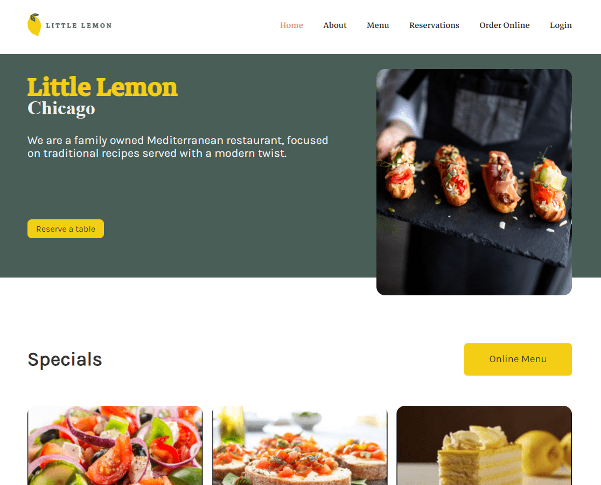

# Proyecto Final del Certificado profesional de Desarrollador front-end de Meta

## Little Lemon Website


### URL 🌐 [Little Lemon ](https://eapp-little-lemon.netlify.app)

-----

## Configuración Inicial

Asegúrate de tener Node.js y npm instalados en tu sistema. Si no los tienes, puedes descargarlos desde [Node.js](https://nodejs.org/).


### Instalación e inicialización del proyecto

1. Clona el repositorio:

   ``` bash
   git clone https://github.com/EAPP93/meta-little-lemon-web.git
   ```

1. Ingresa a la carpeta del proyecto:

   ``` bash
   cd tu-proyecto-react
   ```

1. Instala las dependencias del proyecto:

   ``` bash
   npm install
   ```

1. Inicialización del proyecto:

   ``` bash
   npm start
   ```

----
** IMPORTANTE!!! - El proyecto es configurado para lanzar el servido en el puerto 3000 en el navegador google chrome**